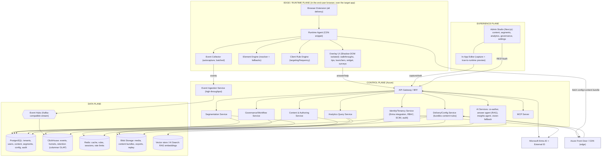
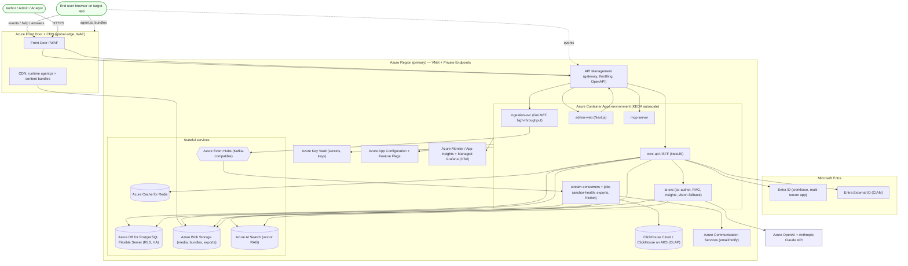
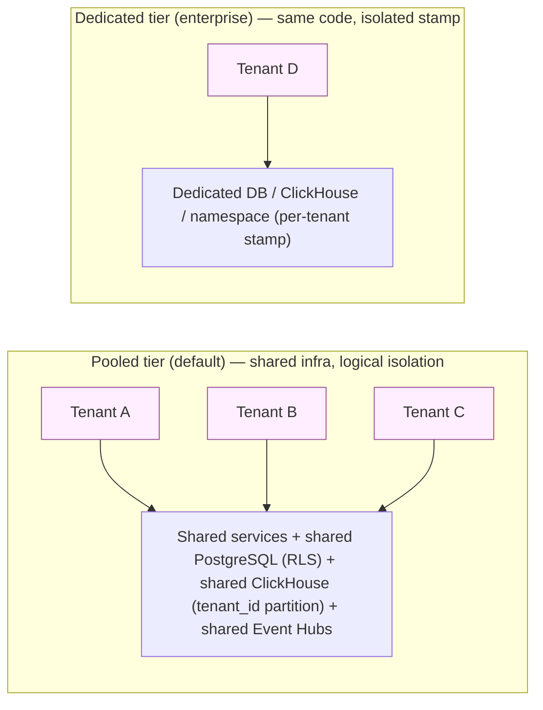
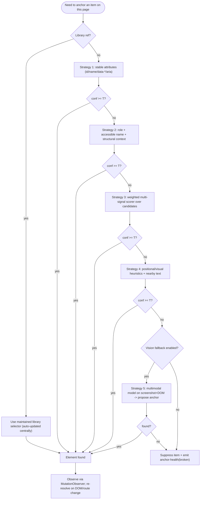
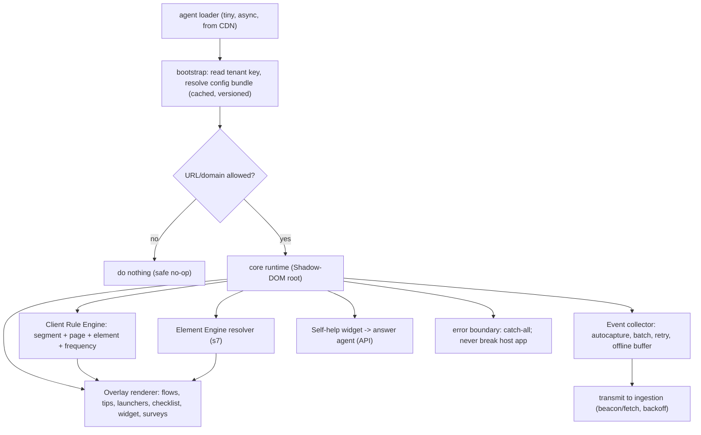
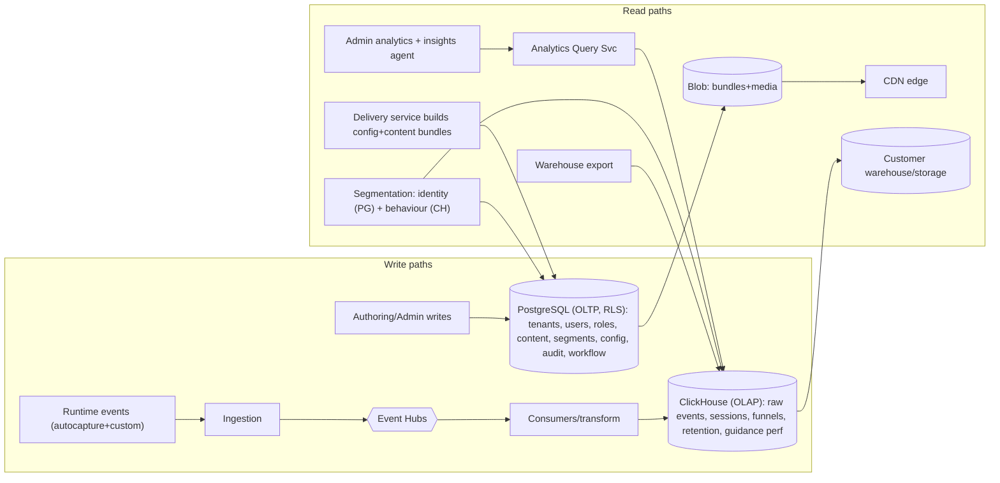
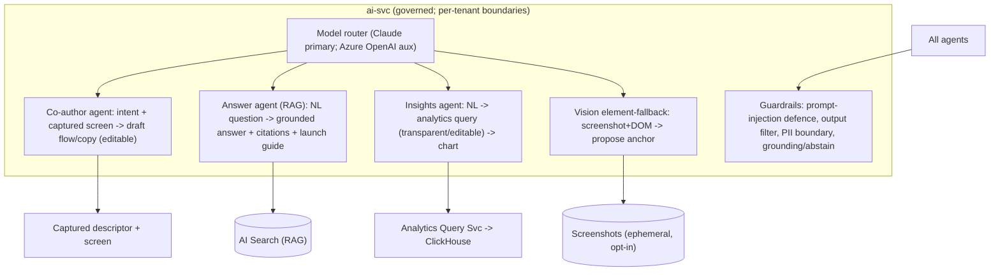
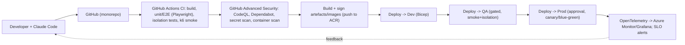

# 03 — Solution Architecture & Design

> **Product:** Adopta (DAP) · **Status:** Baseline v1.0
> **Realises:** the requirements in `02-functional-requirements.md`. **Diagrams** are Mermaid (render on GitHub / VS Code / Claude Code).
> **Decision posture:** Azure-native and Microsoft-secured per the project mandate, AI-native per the differentiation strategy. Where a choice is opinionated, the rationale and a documented alternative are given so you can adjust.

---

## 1. Architectural Goals & Drivers

| Driver | Implication |
|---|---|
| **Production-ready, not MVP** | Multi-tenant isolation, RBAC, audit, observability, CI/CD, IaC from commit #1. |
| **Microsoft-secured** | Identity on **Microsoft Entra** (workforce + External ID); Azure-native services; Key Vault; Conditional Access. |
| **Bleeding-edge & AI-native** | Agentic authoring, RAG answer agent, NL insights, vision-based element fallback, MCP server; modern OLAP analytics. |
| **Zero-code on target apps** | Runtime injected via CDN snippet / extension; resilient element engine; self-contained, isolated overlay. |
| **Closed-loop, one data model** | Shared identity/event/segment model across analytics, guidance, engagement. |
| **Scale + cost discipline** | Pooled multi-tenant, serverless-leaning compute, columnar analytics store, CDN edge delivery. |
| **Built with Claude + Claude Code + GitHub** | TypeScript-first monorepo, shared types, strong test scaffolding, IaC, GitHub Actions. |

---

## 2. Logical Architecture (conceptual)

Four planes: **Edge/Runtime** (in the user's browser, on the target app), **Experience** (admin studio), **Control Plane** (APIs, services, AI), and **Data Plane** (transactional + analytical + AI knowledge).



**Reading the diagram:** the **runtime agent** loads from the **CDN**, pulls a **cacheable config+content bundle** (built by the Delivery service), evaluates targeting **client-side**, renders an **isolated overlay**, resolves anchors with the **Element Engine**, and streams **autocaptured events** through **Ingestion → Event Hubs → ClickHouse**. The **Admin Studio** + **In-App Editor** drive the Control Plane via the gateway, all behind **Entra** identity. **AI Services** power co-authoring, the **RAG answer agent**, **NL insights**, and the **vision element-fallback**. The **MCP server** exposes the platform to AI tooling.

---

## 3. Physical Architecture (Azure deployment)

Recommended target: **Azure Container Apps** for services (managed, KEDA autoscaling, fast DX, great with Claude Code) with **AKS** as the scale-out alternative for teams needing full Kubernetes control. Analytics on **ClickHouse** (Cloud or self-managed on AKS). Everything fronted by **Front Door** and secured by **Entra + Key Vault + Private Endpoints**.



**Notes**
- **Private networking:** services run in a VNet; PostgreSQL, Redis, Event Hubs, Blob, AI Search, Key Vault reach over **Private Endpoints**. Public ingress only via **Front Door/WAF → API Management**.
- **Regions/DR:** primary region active; design for **multi-region** read replicas (Postgres), **geo-redundant** Blob, and **ClickHouse replication** for DR. Front Door provides global routing/failover.
- **ClickHouse placement:** **ClickHouse Cloud** (lowest ops) on Azure, or self-managed on **AKS** for control/cost at scale. Either way it is the analytical system of record for events.

---

## 4. Technology Stack (with rationale & alternatives)

| Layer | Recommended | Why | Documented alternative |
|---|---|---|---|
| **Cloud** | **Microsoft Azure** | Mandated Microsoft security; tight Entra + Key Vault + Front Door integration | — |
| **Identity** | **Microsoft Entra ID** (multi-tenant app) + **Entra External ID** (CIAM); **MSAL** libs | Current Microsoft platform; **Azure AD B2C is end-of-sale (1 May 2025)** — do **not** use for greenfield | Generic OIDC/SAML federation for non-MS tenants |
| **Monorepo / tooling** | **pnpm + Turborepo**, TypeScript everywhere, shared `packages/types` | One language across SDK/admin/services → ideal for Claude Code; shared contracts | Nx |
| **Admin web** | **Next.js (React 19, App Router, RSC)** + TypeScript + Tailwind + shadcn/ui | Modern, fast, server components, great DX; design tokens via `frontend-design` skill | Remix |
| **Runtime SDK** | **TypeScript**, **Preact**-or-vanilla overlay, built with **Vite/esbuild**, **Shadow-DOM** isolation, shipped to CDN | Tiny footprint, framework-agnostic, isolated from host app | Lit / vanilla web components |
| **Browser extension** | **Manifest V3** (Chrome/Edge/Firefox) sharing the SDK core | Client-side URL match; alt delivery where snippet impossible | — |
| **Core API / BFF** | **NestJS** (Node/TS), REST + OpenAPI, Zod validation | TS consistency, structured, testable, fast to build with Claude | **.NET 10 ASP.NET Core minimal APIs** (deep Azure/Entra alignment) |
| **Event ingestion** | **Go** (or **.NET**) lightweight high-throughput service | Throughput + low cost on the hot path | Node with clustering (lower ceiling) |
| **Streaming** | **Azure Event Hubs** (Kafka protocol) | Managed, Kafka-compatible, scales | Confluent/Kafka on AKS |
| **Stream processing/jobs** | **Container Apps Jobs** + consumer workers | Simple, autoscaling (KEDA), cost-aware | Azure Stream Analytics / Flink |
| **Analytics OLAP** | **ClickHouse** (Cloud or AKS) | De-facto standard for product analytics at scale (columnar, sub-second funnels/retention); powers the closed loop | Apache Pinot / Druid; Microsoft Fabric/Synapse for warehouse-style |
| **Transactional DB** | **Azure DB for PostgreSQL Flexible Server** + **Row-Level Security**; **Prisma/Drizzle** ORM; **pgvector** optional | Reliable OLTP; **RLS** enforces tenant isolation at the DB; HA | Azure SQL (if .NET-led) |
| **Cache / rules / sessions** | **Azure Cache for Redis** | Hot config, rule eval inputs, rate limits, sessions | — |
| **Object storage / CDN** | **Azure Blob Storage** + **Azure Front Door/CDN** | Media, **versioned content bundles**, exports, replay; edge delivery + WAF | — |
| **RAG / search** | **Azure AI Search** (vector + keyword hybrid) | Grounds the answer agent; hybrid retrieval; security-trimmed | pgvector for smaller scale |
| **AI models** | **Anthropic Claude API** (reasoning, co-author, answer/insights agents, **vision element-fallback**) + **Azure OpenAI** (embeddings/aux) | Project is Claude-centric; Claude multimodal for vision fallback; Azure OpenAI for in-Azure embeddings | Model-router abstraction to swap providers |
| **Agent framework / MCP** | **MCP server** (TS SDK) exposing analytics + content tools | First-class AI interface; aligns with Claude workflow; matches category direction (orchestration) | — |
| **Compute** | **Azure Container Apps** (KEDA) | Managed, scale-to-zero, fast, great DX | **AKS** for full control at scale |
| **API gateway** | **Azure API Management** behind **Front Door/WAF** | Throttling, versioning, OpenAPI, per-tenant policies | Front Door + app gateway only |
| **Secrets / config** | **Azure Key Vault** + **App Configuration** (+ feature flags) | No secrets in source; runtime flags; managed identities | — |
| **IaC** | **Bicep** (Azure-native) | First-class Azure, concise, MS-aligned | **Terraform** (multi-cloud portability) |
| **CI/CD** | **GitHub Actions** + **GitHub Advanced Security** (CodeQL, Dependabot, secret scanning) | Mandated GitHub; integrated security gates | Azure DevOps Pipelines |
| **Observability** | **OpenTelemetry** → **Azure Monitor / App Insights** + **Managed Grafana** | Vendor-neutral standard; traces/metrics/logs; per-tenant dashboards | Datadog/Grafana Cloud |
| **Testing** | **Vitest/Jest** (unit), **Playwright** (E2E incl. element-engine harness), **k6** (load), **Pact** (contract) | Element engine + isolation need real-browser + load coverage | — |
| **Email/notify** | **Azure Communication Services** | In-Azure email/SMS for invites, alerts | SendGrid |

> **Language note:** If your team is .NET-first (common in Microsoft shops), the **core API and ingestion can be .NET 10** while the **SDK and admin remain TypeScript**. The architecture is otherwise unchanged. The default here is TypeScript-first purely to maximise shared types and Claude-Code velocity.

---

## 5. Multi-Tenancy Model

**Model: pooled (shared) multi-tenant by default, with a documented seam to silo high-tier tenants.** This is the standard, cost-efficient SaaS posture (per Azure's SaaS multitenant guidance) and matches how the incumbents operate.



**Isolation mechanisms**
- **Identity:** every request carries a validated **tenant context** derived from the token (Entra tenant / External ID app) → injected into every service call and DB session.
- **Transactional (PostgreSQL):** **Row-Level Security** policies keyed on `tenant_id` + a `SET app.tenant_id` per connection; the ORM data-access layer **always** scopes by tenant. Belt-and-braces: app-layer guards **and** DB-layer RLS.
- **Analytical (ClickHouse):** `tenant_id` as a leading **partition/sort key**; query service **injects a mandatory tenant predicate**; optional per-tenant databases for the dedicated tier.
- **Object storage:** tenant-prefixed containers/paths; SAS scoped per tenant; optional tenant-managed storage account (`FR-IDN-033`).
- **Streaming:** `tenant_id` on every event; partitioning balanced to avoid hot tenants.
- **Noisy-neighbour controls:** per-tenant **rate limits** (Redis), ingestion **quotas**, and query **resource caps**.
- **Verification:** **automated cross-tenant isolation tests** (`FR-IDN-031`, `NFR-SEC-3`) run in CI and **gate releases** — attempt cross-tenant reads via API and DB and assert denial.
- **Silo seam:** tenant routing reads a **tenant→stamp map**; promoting a tenant to dedicated changes routing/config only — **no code change** (`NFR-SCALE-1`).

---

## 6. Security Architecture

### 6.1 Identity & access (Microsoft Entra)

```mermaid
sequenceDiagram
  participant U as User
  participant App as Adopta (Admin/Runtime)
  participant Entra as Entra ID / External ID
  participant API as Core API
  Note over App,Entra: Workforce tenants federate their OWN Entra via multi-tenant app;<br/>external/customer users via Entra External ID (CIAM)
  U->>App: Access Adopta
  App->>Entra: OIDC auth request (PKCE)
  Entra->>Entra: Apply Conditional Access + MFA (phishing-resistant)
  Entra-->>App: ID token + auth code
  App->>Entra: Exchange code -> access/refresh tokens
  U->>API: Request + access token
  API->>API: Validate issuer/audience/signature; derive tenant + roles
  API->>API: Enforce RBAC + tenant scoping (RLS context)
  API-->>U: Authorized response
```

- **Workforce (B2B SaaS):** Adopta is a **multi-tenant Entra application**; customer admins **consent** and their users sign in with corporate Entra identities. **SCIM** automates lifecycle; **Conditional Access/MFA** are honoured; MFA/device claims from the home tenant can be **trusted**.
- **Customer/consumer (CIAM):** **Microsoft Entra External ID** (external tenant) for self-sign-up/social/email — the **current** platform (B2C is end-of-sale for new customers). No legacy custom XML policies.
- **Non-Microsoft tenants:** generic **OIDC/SAML** federation (Okta/Ping/Google).
- **Tokens:** short-lived access tokens, rotating refresh tokens, full validation per request, revocation on deactivation.
- **Service identity:** Azure **Managed Identities** for service-to-Azure auth; **no secrets in code**; Key Vault for the rest.

### 6.2 Application & data protection
- **In transit:** TLS 1.2+ everywhere, HSTS; **at rest:** Azure-managed encryption + Key Vault-held keys; field-level encryption for the most sensitive config.
- **Runtime security:** the agent is **CSP-friendly**, served from a known CDN origin with **Subresource Integrity**; content bundles are **signed/versioned**; the overlay is **Shadow-DOM isolated** and removable; **strict domain/URL scoping** (`FR-IDN-041`).
- **Privacy by construction:** autocapture is **structure-only** by default; **masking/redaction** policies (default-on for sensitive inputs); **data residency** per tenant; retention + **right-to-erasure** tooling (`NFR-PRIV-1`).
- **AppSec pipeline:** OWASP ASVS alignment; **CodeQL (SAST), Dependabot, secret scanning, container/image scanning, DAST**; signed artefacts; least-privilege everywhere.
- **Compliance trajectory:** controls and evidence aligned to **SOC 2 Type II / ISO 27001 / GDPR**; DPA + sub-processor list; audit log immutability (`FR-IDN-040`).
- **AI safety:** prompt-injection defences for the answer/insights agents (the runtime ingests untrusted page content — treat it as untrusted), output filtering, **RAG grounding with citations and "I don't know"** behaviour, per-tenant data boundaries for embeddings, and **no PII egress** on the vision fallback unless explicitly opted in.

---

## 7. The Element Engine (deep dive — the durability moat)

The single highest-risk component. It must **anchor guidance to elements in apps we don't control and survive UI change**. Design mirrors the best of WalkMe DeepUI / jQuery fallback / Element Library and Whatfix ScreenSense (vision), as a **layered resolver**.

### 7.1 Capture — the multi-signal descriptor
On author capture, store a **descriptor**, not a single selector:

```jsonc
{
  "signals": {
    "stableAttrs": { "id": "...", "name": "...", "data-testid": "...", "aria-*": "..." },
    "role": "button", "tag": "button",
    "accessibleName": "Submit invoice",
    "textHash": "structural-text-fingerprint",     // not raw user content
    "classTokens": [{ "token": "btn-primary", "weight": 0.6 }],
    "structure": { "ancestorRoles": ["form","section"], "siblingIndex": 2, "depthHints": [...] },
    "geometry": { "relBox": [..], "anchorTextNearby": "Invoice actions" },
    "frame": "main|shadow:host-selector|iframe:same-origin"
  },
  "appProfile": "salesforce-lightning|dynamics-365|generic",
  "libraryRef": "optional pointer to maintained Element Library entry"
}
```

### 7.2 Resolve — confidence-scored matching (runtime)



- **Confidence threshold (T):** tuned per app profile; ambiguous multi-matches are disambiguated by structure/geometry or suppressed (never guess destructively).
- **Vision fallback (`FR-ELM-004`):** when DOM strategies fail, a **multimodal model** (Claude vision) locates the element from a **screenshot + DOM context** and **proposes a new descriptor** for author confirmation. Privacy-gated (tenant opt-in; structural data only; no PII egress).
- **SPA/dynamic:** a debounced **MutationObserver** + history/route hooks trigger re-resolution; supports late-rendered and hover-revealed elements (state machine per item).
- **Shadow DOM / iframes:** scoped/pierced queries for Shadow DOM and same-origin iframes; cross-origin reported as a limitation (`FR-ELM-008`).

### 7.3 Maintain — anchor health & library
- **Anchor-health monitor** (`SWORK` job + optional runtime telemetry): periodically validates descriptors against target apps and on real failures emits **anchor-health events** → alerts listing affected items (`FR-ELM-005`).
- **Remediation:** **one-action re-capture** and **bulk find/replace** across content (`FR-ELM-006`).
- **Element Library** (`FR-ELM-007`): vendor-maintained descriptors for top apps (M365, Dynamics, Salesforce, Workday, ServiceNow). When a platform changes, we update the library **once** and all bound content **inherits the fix** — the key maintenance differentiator from WalkMe.

---

## 8. Runtime SDK Architecture (the in-browser agent)



**Principles realised:** async + non-blocking (`FR-DEL-010`, `NFR-PERF-1/2`); **CDN-cached versioned bundles**, no per-page server round-trip (`FR-DEL-012`); **client-side targeting** so only eligible content is requested (`FR-DEL-013`); **Shadow-DOM isolation** + clean teardown (`FR-DEL-014`); **fail-safe** error boundary (`FR-DEL-015`); **preview/QA channel** for unpublished content (`FR-DEL-016`); **WCAG 2.2 AA**, keyboard, reduced-motion (`NFR-A11Y-1`). The **same core** powers the **browser extension** (MV3) by injecting the agent after client-side URL match (`FR-DEL-011`).

---

## 9. Data Architecture

Two systems of record by workload, unified by **shared identity + event schema** (the closed-loop principle).



- **PostgreSQL (OLTP):** authoritative for **configuration and content** — tenants, users/roles, content items, segments, rules, governance/workflow, audit. Tenant isolation via **RLS**. ORM with generated, tenant-scoped queries.
- **ClickHouse (OLAP):** authoritative for **behaviour** — raw events, derived sessions, and materialised views for funnels/retention/guidance-performance. **Retroactive tagging** works because raw events are retained and definitions are applied at query/materialisation time (`FR-ANL-002`). `tenant_id` leads partitioning.
- **Event pipeline:** `Ingestion → Event Hubs → consumers → ClickHouse`. Idempotent, schema-validated, per-tenant rate-limited, horizontally scalable (`FR-ANL-004`).
- **Segmentation** joins **identity traits (PG)** with **behaviour (CH)**; cohorts are **saveable as segments** for targeting (closes the loop, `FR-DEL-004`).
- **RAG store:** content + connected knowledge embedded into **Azure AI Search** (security-trimmed per tenant) for the answer agent.
- **Export:** scheduled/streamed event + aggregate export to the **customer warehouse/storage** with a documented schema (`FR-ANL-021`).
- **Retention & privacy:** per-tenant retention windows; masking applied at capture; erasure tooling removes a subject across PG/CH/Blob.

---

## 10. AI Architecture (agentic services)



- **Human-in-the-loop:** co-author/insights outputs are **always editable**; nothing AI-generated auto-publishes (`FR-AUT-021`, Principle 6).
- **Grounding:** the answer agent is **RAG-grounded with citations** and **abstains** when unsupported (`FR-HLP-003`).
- **Transparency:** the insights agent **exposes the generated query** (`FR-ANL-020`).
- **Safety:** the runtime ingests **untrusted page content** → agents apply **prompt-injection defences**, output filtering, and strict **per-tenant data boundaries**; vision fallback is **opt-in** with **no PII egress** (`§6.2`).
- **MCP server:** exposes analytics + content/segment tools to MCP clients (Claude/Cursor) under tenant auth + RBAC (`FR-INT-003`) — both a product feature and a powerful internal build/ops accelerator.

---

## 11. DevOps, Environments & Delivery



- **Environments:** **dev / QA / prod** (mirrors content environments in `FR-GOV-002`), each an isolated Azure stamp via **Bicep**.
- **CI gates (must pass to merge/deploy):** build, unit + **Playwright E2E** (including an **element-engine resilience harness** against snapshotted target-app DOMs), **cross-tenant isolation tests**, **CodeQL/Dependabot/secret/container scans**, accessibility checks, and **k6** smoke load.
- **Deploy:** signed images to **ACR**; **canary/blue-green** to Container Apps; automatic rollback on SLO breach; **content** deploys are independent (versioned bundles to Blob/CDN) with one-click rollback.
- **Config/secrets:** **App Configuration** + **Key Vault** via **Managed Identity**; feature flags for progressive rollout.
- **Observability:** **OpenTelemetry** traces/metrics/logs → **Azure Monitor/App Insights + Managed Grafana**; **per-tenant** dashboards and SLO burn alerts (`NFR-OBS-1`).

---

## 12. Recommended Monorepo Structure

```
adopta/
├─ apps/
│  ├─ admin-web/            # Next.js admin studio (incl. in-app editor host)
│  ├─ core-api/            # NestJS BFF/control plane (or .NET 10 alt)
│  ├─ ingestion-svc/       # Go/.NET high-throughput event intake
│  ├─ stream-consumers/    # Event Hubs consumers, anchor-health, friction, exports
│  ├─ ai-svc/              # co-author, answer (RAG), insights, vision-fallback
│  └─ mcp-server/          # MCP interface to analytics + content
├─ packages/
│  ├─ runtime-sdk/         # the in-browser agent (CDN bundle)
│  ├─ browser-extension/   # MV3 wrapper around runtime-sdk
│  ├─ element-engine/      # capture + resolver + scorer (shared SDK/server)
│  ├─ types/               # shared TS contracts (events, content, API)
│  ├─ ui/                  # shared React component library + design tokens
│  └─ analytics-schema/    # event schema + ClickHouse migrations
├─ infra/                  # Bicep (Azure stamps, networking, services) [or terraform/]
├─ .github/workflows/      # CI/CD, security gates
└─ docs/                   # these specifications
```

This structure (shared `types`, shared `element-engine`, clear app/package split) is deliberately **Claude-Code-friendly**: contracts are centralised, the riskiest logic is isolated and independently testable, and each app is a clean build target.

---

## 13. Key Architectural Decisions (ADR summary)

| # | Decision | Rationale | Trade-off accepted |
|---|---|---|---|
| ADR-1 | **Azure + Entra** as the platform | Microsoft-security mandate; tightest identity/secrets integration | Some cloud lock-in (mitigated by containers/OTel/Terraform option) |
| ADR-2 | **Entra External ID (not B2C)** for CIAM | B2C end-of-sale 1 May 2025; External ID is the current platform | Newer platform; fewer legacy samples |
| ADR-3 | **ClickHouse** for analytics | Sub-second funnels/retention at scale; powers closed loop; retroactive tagging | Another datastore to operate (Cloud option mitigates) |
| ADR-4 | **Pooled multi-tenant + RLS**, silo seam | Cost-efficient default, enterprise option without re-platforming | Requires rigorous isolation testing |
| ADR-5 | **Layered element engine + vision fallback** | Durability is the moat; vision recovers where DOM fails | Vision adds cost/latency → gated, last-resort |
| ADR-6 | **TypeScript-first monorepo** | Shared types, one language, Claude-Code velocity | Hot-path services may prefer Go/.NET (allowed) |
| ADR-7 | **CDN-cached versioned bundles + client-side rules** | Performance + resilience; runtime works during backend hiccups | Cache invalidation complexity |
| ADR-8 | **MCP server as first-class interface** | Aligns with Claude workflow + Gartner orchestration direction | Emerging standard; evolving |
| ADR-9 | **Container Apps (AKS alt)** | Managed, autoscaling, fast DX | Less control than raw K8s (AKS seam provided) |
| ADR-10 | **OpenTelemetry** observability | Vendor-neutral, future-proof | Slightly more setup than a single-vendor agent |

---

## 14. Phased Build Plan (architecture-aligned)

1. **Phase 0 — Foundations:** monorepo, IaC stamps, **Entra auth + multi-tenant + RLS**, RBAC, audit, CI/CD + security gates, observability, the **isolation-test harness**.
2. **Phase 1 — Core guidance loop:** runtime SDK + **element engine v1** (DOM strategies), in-app editor, walkthroughs/tips/launchers, delivery (CDN bundles), basic targeting. *(Outcome: ship a durable walkthrough end-to-end.)*
3. **Phase 2 — Analytics + closed loop:** autocapture ingestion → Event Hubs → **ClickHouse**, funnels/retention/guidance-performance, segmentation from cohorts, friction detection v1.
4. **Phase 3 — Self-service + AI:** self-help widget, **RAG answer agent**, **AI co-author**, **insights agent**, **MCP server**.
5. **Phase 4 — Enterprise + resilience:** governance/approvals/environments/rollback, **anchor-health + Element Library**, surveys/NPS, connectors, exports, **vision element-fallback**, data residency.
6. **Phase 5 — Frontier/roadmap:** mobile SDK, session replay, sandbox/simulation, cross-app agent orchestration.

Each phase is independently shippable and testable, and reserves seams for the next.

---

### Companion
The build is operationalised by `05-claude-build-prompt.md` (a master prompt for Claude Code to scaffold and implement this architecture phase-by-phase). Screen designs are in `04-wireframes.md`.
